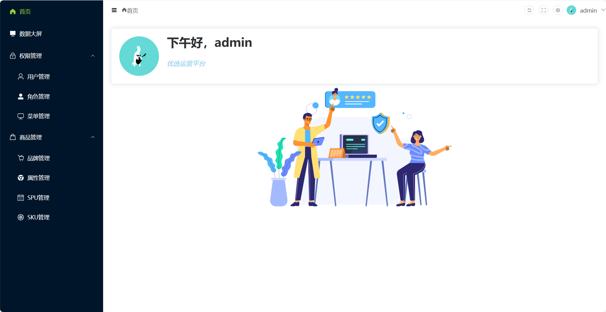
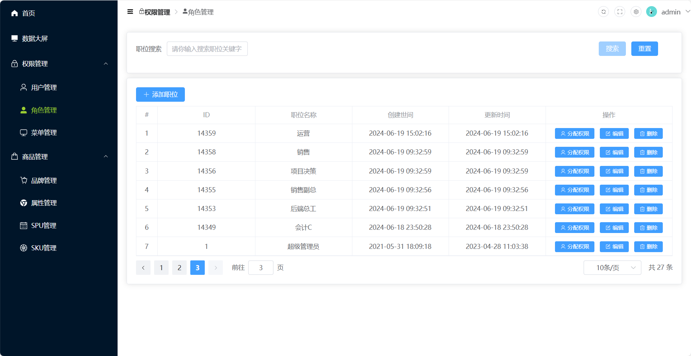
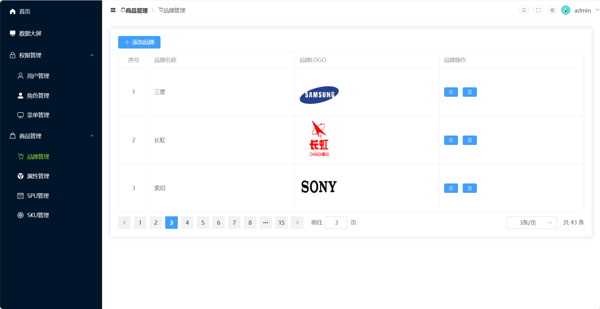

# 项目介绍

甄选平台/优选平台是一个后台前端解决方案，它基于 vue3 和 element-plus 实现。可用于产品/商品管理，主要用于管理SKU和SPU信息。同时，为不同的角色设置了不同的权限。该项目使用由其他供应商开源的API接口。

- 技术栈

```
Vue3
TS
Vite
Element Plus
Pinia
Vue-Router
Axios
pnpm
```

- 公共接口 ：由尚硅谷提供

```
http://139.198.104.58:8212/swagger-ui.html#/
http://39.98.123.211:8510/swagger-ui.html
```

- 参考

```
本项目由尚硅谷硅谷甄选项目改造而成。
尚硅谷官方网址：https://space.bilibili.com/302417610?spm_id_from=333.788.0.0
硅谷甄选官方网址：https://www.bilibili.com/video/BV1Xh411V7b5/?spm_id_from=333.337.search-card.all.click
```


# 开发

```
# 克隆项目
git clone https://github.com/aPurpleBerry/Vue_project_SelectionPlatform.git
# 进入项目
cd vue3_admin_template
# 安装依赖
pnpm i
# 本地开发 启动项目
pnpm run dev
```

## 文件夹说明

- vue3_admin_template1

  是因为打包的时候出错，但是改错了很多地方，代码无法运行了……所以这个文件夹是不能用的。

- vue3_admin_template

  是我从我的GitHub中拉取下来的之前正确的代码。

- img

  这个是typora笔记中保存的截图

# Online Demo

[优选运营平台](http://www.apurpleberry.cn:82/#/login?redirect=/home)

# 效果图


- 首页



- 角色管理



- 商品管理


