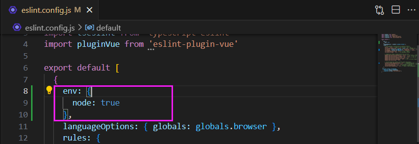

# 需要补的知识点

ES6 import export module

webpack

eslint

prettier

sass

# 一、项目初始化

vite搭建vue3项目

- vite官网：https://www.vitejs.net/guide/

> 兼容性问题：Vite 需要 [Node.js](https://nodejs.org/en/) 版本 >= 12.0.0。
>
> 我的：
>
> 

- Vite 项目可以通过 npm yarn pnpm 搭建。这里用pnpm。

pnpm安装指令

```powershell
npm i -g pnpm
# 查看pnpm版本  pnpm- v
```

 

- 新建文件夹，创建项目

项目初始化命令:

```powershell
pnpm create vite
```


选择VUE框架和TS之后，创建成功：


接下来根据提示，需要进入文件夹内部 ① pnpm install 安装所有的依赖，

②  pnpm run dev 运行项目

# 二、项目配置

## 运行成功自动打开


<font color="red">**注意本项目用的是pnpm**</font>

## 1、eslint配置

ESLint最初是由[Nicholas C. Zakas](http://nczonline.net/) 于2013年6月创建的开源项目。它的目标是提供一个插件化的**javascript代码检测工具**（检测 JS 代码质量）

- 在项目根目录打开CMD

- 【步骤一】首先安装eslint

```powershell
pnpm i eslint -D
```

- 【步骤二】生成配置文件:.eslint.cjs

```
npx eslint --init
```


- 【步骤三】**.eslint.cjs配置文件**

```typescript
module.exports = {
   //运行环境
    "env": { 
        "browser": true,//浏览器端工作
        "es2021": true,//es2021 校验ES语法
    },
    //规则继承
    "extends": [ 
       //全部规则默认是关闭的,这个配置项开启推荐规则,推荐规则参照文档
       //比如:函数不能重名、对象不能出现重复key
         
        "eslint:recommended", // 开启推荐规则
        //vue3语法规则
        "plugin:vue/vue3-essential",
        //ts语法规则
        "plugin:@typescript-eslint/recommended"
    ],
    //要为特定类型的文件指定处理器
    "overrides": [
    ],
    
    //指定解析器:解析器
    //Esprima 默认解析器
    //Babel-ESLint babel解析器
    //@typescript-eslint/parser ts解析器
    "parser": "@typescript-eslint/parser",
    
    //指定解析器选项
    "parserOptions": {
        "ecmaVersion": "latest",//校验ECMA最新版本
        "sourceType": "module"//设置为"script"（默认），或者"module"代码在ECMAScript模块中
    },
    //ESLint支持使用第三方插件。在使用插件之前，您必须使用npm安装它
    //该eslint-plugin-前缀可以从插件名称被省略
    "plugins": [
        "vue", //检测vue语法的插件
        "@typescript-eslint" // 检测TS语法的插件
    ],
    //eslint规则
    "rules": {
    }
}
```

### 【问题】我的是 eslint.config.js 而不是 eslintrc.cjs

> 官网https://www.tkcnn.com/eslint/configuring/configuration-files-new.html#%E9%85%8D%E7%BD%AE%E5%AF%B9%E8%B1%A1

只有这几行：

```typescript
import globals from "globals";
import pluginJs from "@eslint/js";
import tseslint from "typescript-eslint";
import pluginVue from "eslint-plugin-vue";


export default [
  {languageOptions: { globals: globals.browser }},
  pluginJs.configs.recommended,
  ...tseslint.configs.recommended,
  ...pluginVue.configs["flat/essential"],
];
```

### 1.1vue3环境代码校验插件

安装指令

```
pnpm install -D eslint-plugin-import eslint-plugin-vue eslint-plugin-node eslint-plugin-prettier eslint-config-prettier eslint-plugin-node @babel/eslint-parser
```


```
# 让所有与prettier规则存在冲突的Eslint rules失效，并使用prettier进行代码检查
"eslint-config-prettier": "^8.6.0",
"eslint-plugin-import": "^2.27.5",
"eslint-plugin-node": "^11.1.0",
# 运行更漂亮的Eslint，使prettier规则优先级更高，Eslint优先级低
"eslint-plugin-prettier": "^4.2.1",
# vue.js的Eslint插件（查找vue语法错误，发现错误指令，查找违规风格指南
"eslint-plugin-vue": "^9.9.0",
# 该解析器允许使用Eslint校验所有babel code
"@babel/eslint-parser": "^7.19.1",
```

### 1.2修改.eslintrc.cjs配置文件

加了rules

```typescript
// @see https://eslint.bootcss.com/docs/rules/

module.exports = {
  env: {
    browser: true,
    es2021: true,
    node: true,
    jest: true,
  },
  /* 指定如何解析语法 */
  parser: 'vue-eslint-parser',
  /** 优先级低于 parse 的语法解析配置 */
  parserOptions: {
    ecmaVersion: 'latest',
    sourceType: 'module',
    parser: '@typescript-eslint/parser',
    jsxPragma: 'React',
    ecmaFeatures: {
      jsx: true,
    },
  },
  /* 继承已有的规则 */
  extends: [
    'eslint:recommended',
    'plugin:vue/vue3-essential',
    'plugin:@typescript-eslint/recommended',
    'plugin:prettier/recommended',
  ],
  plugins: ['vue', '@typescript-eslint'],
  /*
   * "off" 或 0    ==>  关闭规则
   * "warn" 或 1   ==>  打开的规则作为警告（不影响代码执行）
   * "error" 或 2  ==>  规则作为一个错误（代码不能执行，界面报错）
   */
  rules: {
    // eslint（https://eslint.bootcss.com/docs/rules/）
    'no-var': 'error', // 要求使用 let 或 const 而不是 var
    'no-multiple-empty-lines': ['warn', { max: 1 }], // 不允许多个空行
    'no-console': process.env.NODE_ENV === 'production' ? 'error' : 'off',
    'no-debugger': process.env.NODE_ENV === 'production' ? 'error' : 'off',
    'no-unexpected-multiline': 'error', // 禁止空余的多行
    'no-useless-escape': 'off', // 禁止不必要的转义字符

    // typeScript (https://typescript-eslint.io/rules)
    '@typescript-eslint/no-unused-vars': 'error', // 禁止定义未使用的变量
    '@typescript-eslint/prefer-ts-expect-error': 'error', // 禁止使用 @ts-ignore
    '@typescript-eslint/no-explicit-any': 'off', // 禁止使用 any 类型
    '@typescript-eslint/no-non-null-assertion': 'off',
    '@typescript-eslint/no-namespace': 'off', // 禁止使用自定义 TypeScript 模块和命名空间。
    '@typescript-eslint/semi': 'off',

    // eslint-plugin-vue (https://eslint.vuejs.org/rules/)
    'vue/multi-word-component-names': 'off', // 要求组件名称始终为 “-” 链接的单词
    'vue/script-setup-uses-vars': 'error', // 防止<script setup>使用的变量<template>被标记为未使用
    'vue/no-mutating-props': 'off', // 不允许组件 prop的改变
    'vue/attribute-hyphenation': 'off', // 对模板中的自定义组件强制执行属性命名样式
  },
}

```

#### 【问题】rules中 'process' is not defined

 

### 1.3.eslintignore忽略文件

根目录下创建 .eslintignore 文件

```
dist
node_modules
```

#### 【问题】.eslintignore忽略文件（被废除）

报错：

```
(node:17472) ESLintIgnoreWarning: The ".eslintignore" file is no longer supported. Switch to using the "ignores" property in "eslint.config.js": https://eslint.org/docs/latest/use/configure/migration-guide#ignoring-files
(Use `node --trace-warnings ...` to show where the warning was created)
```

 


### 1.4运行脚本

package.json新增两个运行脚本

```typescript
"scripts": {
    "lint": "eslint src", // 执行lint的时候，检测src中的代码
    "fix": "eslint src --fix", //自动修补
}
```


### 检验

>  pnpm run lint


可以用pnpm run fix自动修补

## 2、prettier配置

有了eslint，为什么还要有prettier？eslint针对的是javascript，他是一个检测工具，包含js语法以及少部分格式问题，在eslint看来，语法对了就能保证代码正常运行，格式问题属于其次；

而prettier属于格式化工具，它看不惯格式不统一，所以它就把eslint没干好的事接着干，另外，prettier支持包含js在内的多种语言。

总结起来，**eslint和prettier这俩兄弟一个保证js代码质量，一个保证代码美观。**

> 官网：https://prettier.nodejs.cn/docs/en/plugins.html

### 2.1安装依赖包

```powershell
pnpm install -D eslint-plugin-prettier prettier eslint-config-prettier
```

### 2.2.prettierrc.json添加规则

<font color="Red">**在项目的根目录下【手动】创建 《.prettierrc.json》**</font>

```json
{
  "singleQuote": true,   // 要求字符串都是单引号
  "semi": false,         // 语句后面设置不加分号  semi是分号
  "bracketSpacing": true, //在对象前后添加空格-eg: { foo: bar }
  "htmlWhitespaceSensitivity": "ignore", //对HTML全局空白不敏感
  "endOfLine": "auto", //结束行形式
  "trailingComma": "all", //多行时尽可能打印尾随逗号
  "tabWidth": 2 // 缩进
}
```

### 2.3.prettierignore忽略文件

<font color="Red">**在项目的根目录下【手动】创建 《.prettierignore》忽略文件**</font>

```
/dist/*
/html/*
.local
/node_modules/**         不需要格式化
**/*.svg
**/*.sh
/public/*
```

### 2.4检查

**通过 【pnpm run lint】去检测语法，如果出现不规范格式,通过pnpm run fix 修改**

### 【问题】我的prettier无效

pnpm run lint 无效

## 3、配置stylelint

[stylelint](https://stylelint.io/)为css的lint工具。可格式化css代码，检查css语法错误与不合理的写法，指定css书写顺序等。

我们的项目中使用scss作为预处理器，安装以下依赖：

```
pnpm add sass sass-loader stylelint postcss postcss-scss postcss-html stylelint-config-prettier stylelint-config-recess-order stylelint-config-recommended-scss stylelint-config-standard stylelint-config-standard-vue stylelint-scss stylelint-order stylelint-config-standard-scss -D
```

### 3.1`.stylelintrc.cjs`**配置文件**

**官网:https://stylelint.bootcss.com/**

```
// @see https://stylelint.bootcss.com/

module.exports = {
  extends: [
    'stylelint-config-standard', // 配置stylelint拓展插件
    'stylelint-config-html/vue', // 配置 vue 中 template 样式格式化
    'stylelint-config-standard-scss', // 配置stylelint scss插件
    'stylelint-config-recommended-vue/scss', // 配置 vue 中 scss 样式格式化
    'stylelint-config-recess-order', // 配置stylelint css属性书写顺序插件,
    'stylelint-config-prettier', // 配置stylelint和prettier兼容
  ],
  overrides: [
    {
      files: ['**/*.(scss|css|vue|html)'],
      customSyntax: 'postcss-scss',
    },
    {
      files: ['**/*.(html|vue)'],
      customSyntax: 'postcss-html',
    },
  ],
  ignoreFiles: [
    '**/*.js',
    '**/*.jsx',
    '**/*.tsx',
    '**/*.ts',
    '**/*.json',
    '**/*.md',
    '**/*.yaml',
  ],
  /**
   * null  => 关闭该规则
   * always => 必须
   */
  rules: {
    'value-keyword-case': null, // 在 css 中使用 v-bind，不报错
    'no-descending-specificity': null, // 禁止在具有较高优先级的选择器后出现被其覆盖的较低优先级的选择器
    'function-url-quotes': 'always', // 要求或禁止 URL 的引号 "always(必须加上引号)"|"never(没有引号)"
    'no-empty-source': null, // 关闭禁止空源码
    'selector-class-pattern': null, // 关闭强制选择器类名的格式
    'property-no-unknown': null, // 禁止未知的属性(true 为不允许)
    'block-opening-brace-space-before': 'always', //大括号之前必须有一个空格或不能有空白符
    'value-no-vendor-prefix': null, // 关闭 属性值前缀 --webkit-box
    'property-no-vendor-prefix': null, // 关闭 属性前缀 -webkit-mask
    'selector-pseudo-class-no-unknown': [
      // 不允许未知的选择器
      true,
      {
        ignorePseudoClasses: ['global', 'v-deep', 'deep'], // 忽略属性，修改element默认样式的时候能使用到
      },
    ],
  },
}
```

### 3.2.stylelintignore忽略文件

```
/node_modules/*
/dist/*
/html/*
/public/*
```

### 【问题】'module' is not defined 

> .stylelintrc.cjs 文件的第一行出现了 'module' is not defined.(no-undef)报错

解决方法：掘金文章https://juejin.cn/s/eslint%20%27module%27%20is%20not%20defined.(no-undef)

 

在 JavaScript 中，如果要使用模块系统，需要使用 import 和 export 语句。如果在没有 import 或 export 的情况下使用了 module 变量，ESLint 就会报 'module' is not defined.(no-undef) 的错误。

为了解决这个问题，可以尝试检查你的代码，确保你使用了正确的 import 和 export 语句。如果你的代码中没有使用模块系统，可以在 .eslintrc 文件中的 env 属性中加入 "node": true，以便告诉 ESLint 在解析代码时使用 Node.js 环境。

### 3.3运行脚本

```
"scripts": {
	"lint:style": "stylelint src/**/*.{css,scss,vue} --cache --fix"
}
```

最后配置统一的prettier来格式化我们的js和css，html代码

```
 "scripts": {
    "dev": "vite --open",
    "build": "vue-tsc && vite build",
    "preview": "vite preview",
    "lint": "eslint src",
    "fix": "eslint src --fix",
    "format": "prettier --write \"./**/*.{html,vue,ts,js,json,md}\"",
    "lint:eslint": "eslint src/**/*.{ts,vue} --cache --fix",
    "lint:style": "stylelint src/**/*.{css,scss,vue} --cache --fix"
  },
```

**当我们运行`pnpm run format`的时候，会把代码直接格式化**

## 4、配置husky

在上面我们已经集成好了我们代码校验工具，但是需要每次手动的去执行命令才会格式化我们的代码。如果有人没有格式化就提交了远程仓库中，那这个规范就没什么用。所以我们需要强制让开发人员按照代码规范来提交。

要做到这件事情，就需要利用husky在代码提交之前触发git hook(git在客户端的钩子)，然后执行`pnpm run format`来自动的格式化我们的代码。

安装`husky`

```
pnpm install -D husky
```

执行

```
npx husky-init
```


git 会在根目录下生成个一个.husky目录，在这个目录下面会有一个pre-commit文件，这个文件里面的命令在我们执行git commit的时候就会执行。我们在`.husky/pre-commit`文件添加命令：```pnpm run format```。意思是，在提交到远程仓库之前格式化一下代码。

```
#!/usr/bin/env sh
. "$(dirname -- "$0")/_/husky.sh"
pnpm run format
```

当我们对代码进行commit操作的时候，就会执行命令，对代码进行格式化，然后再提交。

### 【问题】.git can't be found


>Error: .git can't be found (see https://typicode.github.io/husky/#/?id=custom-directory)
>at install (C:\Users\24541\AppData\Local\npm-cache\_npx\1ab9c0f68ac2536e\node_modules\husky\lib\index.js:23:15)
>at Object.<anonymous> (C:\Users\24541\AppData\Local\npm-cache\_npx\1ab9c0f68ac2536e\node_modules\husky-init\lib\bin.js:16:21)

是因为在当前目录下没有 .git

## 5、配置commitlint

对于我们的git commit信息，也是有统一规范的，不能随便写,要让每个人都按照统一的标准来执行，我们可以利用**commitlint**来实现。

安装包

```
pnpm add @commitlint/config-conventional @commitlint/cli -D
```

添加配置文件，新建`commitlint.config.cjs`(注意是cjs)，然后添加下面的代码：

```
module.exports = {
  extends: ['@commitlint/config-conventional'],
  // 校验规则
  rules: {
    'type-enum': [
      2,
      'always',
      [
        'feat',
        'fix',
        'docs',
        'style',
        'refactor',
        'perf',
        'test',
        'chore',
        'revert',
        'build',
      ],
    ],
    'type-case': [0],
    'type-empty': [0],
    'scope-empty': [0],
    'scope-case': [0],
    'subject-full-stop': [0, 'never'],
    'subject-case': [0, 'never'],
    'header-max-length': [0, 'always', 72],
  },
}
```

在`package.json`中配置scripts命令

```
# 在scrips中添加下面的代码
{
"scripts": {
    "commitlint": "commitlint --config commitlint.config.cjs -e -V"
  },
}
```

配置结束，现在当我们填写`commit`信息的时候，前面就需要带着下面的`subject`

```
'feat',//新特性、新功能
'fix',//修改bug
'docs',//文档修改
'style',//代码格式修改, 注意不是 css 修改
'refactor',//代码重构
'perf',//优化相关，比如提升性能、体验
'test',//测试用例修改
'chore',//其他修改, 比如改变构建流程、或者增加依赖库、工具等
'revert',//回滚到上一个版本
'build',//编译相关的修改，例如发布版本、对项目构建或者依赖的改动
```

配置husky

```
npx husky add .husky/commit-msg 
```

在生成的commit-msg文件中添加下面的命令

```
#!/usr/bin/env sh
. "$(dirname -- "$0")/_/husky.sh"
pnpm commitlint
```

当我们 commit 提交信息时，就不能再随意写了，必须是 git commit -m 'fix: xxx' 符合类型的才可以，**需要注意的是类型的后面需要用英文的 :，并且冒号后面是需要空一格的，这个是不能省略的**

### 【问题】说明

因为在 git init 的时候，我没有在当前目录下创建仓库，而是在父文件夹创建了，因此 husky和commitlint 没有实际用在我的项目中

## 6、强制使用pnpm包管理器工具

团队开发项目的时候，需要统一包管理器工具,因为不同包管理器工具下载同一个依赖,可能版本不一样,

导致项目出现bug问题,因此包管理器工具需要统一管理！！！


在根目录创建`scripts/preinstall.js`文件，添加下面的内容

```
if (!/pnpm/.test(process.env.npm_execpath || '')) {
  console.warn(
    `\u001b[33mThis repository must using pnpm as the package manager ` +
    ` for scripts to work properly.\u001b[39m\n`,
  )
  process.exit(1)
}
```

配置命令

```
"scripts": {
	"preinstall": "node ./scripts/preinstall.js"
}
```

**当我们使用npm或者yarn来安装包的时候，就会报错了。原理就是在install的时候会触发preinstall（npm提供的生命周期钩子）这个文件里面的代码。**

- 我的

用npm下载不行：


用pnpm才可以：


### 【问题】script文件夹&npm

视频中老师的script文件夹拼写错误

如果配置完用npm i element-plus看起来还可以下载，只需要再等一会，它就会报错（npm很慢）

# 三、项目集成

## 3.1集成element-plus

硅谷甄选运营平台,UI组件库采用的element-plus，因此需要集成element-plus插件

> 官网地址：https://element-plus.gitee.io/zh-CN/

【步骤一】

```
pnpm install element-plus
pnpm install  @element-plus/icons-vue   // element-plus提供的所有图标组件库
```

【步骤二】

> 本项目是根据官网来的 完整引入

**入口文件main.ts全局安装element-plus,element-plus默认支持语言英语设置为中文**

```typescript
// main.ts
import { createApp } from 'vue'
import ElementPlus from 'element-plus'
import 'element-plus/dist/index.css'
import App from './App.vue'

const app = createApp(App)

app.use(ElementPlus)
app.mount('#app')
```

【步骤三】

在组件中引入图标组件并使用


【步骤四】国际化（中文版）配置

```typescript
import ElementPlus from 'element-plus'
import zhCn from 'element-plus/es/locale/lang/zh-cn'

app.use(ElementPlus, {
  locale: zhCn,
})
```

【步骤五】

**Element Plus全局组件类型声明**

```
// tsconfig.json
{
  "compilerOptions": {
    // ...
    "types": ["element-plus/global"]
  }
}
```

配置完毕可以测试element-plus组件与图标的使用.

## 3.2src别名的配置

在开发项目的时候文件与文件关系可能很复杂，因此我们需要给src文件夹配置一个别名

```
// vite.config.ts
import {defineConfig} from 'vite'
import vue from '@vitejs/plugin-vue'
import path from 'path'  //node
export default defineConfig({
    plugins: [vue()],
    resolve: {
        alias: {
            "@": path.resolve("./src") // 相对路径别名配置，使用 @ 代替 src
        }
    }
})
```

**TypeScript 编译配置**

```
// tsconfig.json
{
  "compilerOptions": {
    "baseUrl": "./", // 解析非相对模块的基地址，默认是当前目录
    "paths": { //路径映射，相对于baseUrl
      "@/*": ["src/*"] 
    }
  }
}
```


### 【问题】找不到path类型声明 

但是可以正常使用

 

解决方法：关闭VS code重新打开就好了

## 3.3环境变量的配置

**项目开发过程中，至少会经历开发环境、测试环境和生产环境(即正式环境)三个阶段。不同阶段请求的状态(如接口地址等)不尽相同，若手动切换接口地址是相当繁琐且易出错的。于是环境变量配置的需求就应运而生，我们只需做简单的配置，把环境状态切换的工作交给代码。**

- 开发环境（development）
  顾名思义，开发使用的环境，每位开发人员在自己的dev分支上干活，开发到一定程度，同事会合并代码，进行联调。

- 测试环境（testing）
  测试同事干活的环境啦，一般会由测试同事自己来部署，然后在此环境进行测试

- 生产环境（production）
  生产环境是指正式提供对外服务的，一般会关掉错误报告，打开错误日志。(正式提供给客户使用的环境。)

注意：一般情况下，一个环境对应一台服务器,也有的公司开发与测试环境是一台服务器！！！


**【操作】**

项目根目录分别添加 开发、生产和测试环境的文件!

```
.env.development
.env.production
.env.test
```

 

**文件内容**

注意：变量必须以 VITE_ 为前缀才能暴露给外部读取

```
# 变量必须以 VITE_ 为前缀才能暴露给外部读取
NODE_ENV = 'development'
VITE_APP_TITLE = '硅谷甄选运营平台'
VITE_APP_BASE_API = '/dev-api'
```

```
NODE_ENV = 'production'
VITE_APP_TITLE = '硅谷甄选运营平台'
VITE_APP_BASE_API = '/prod-api'
```

```
# 变量必须以 VITE_ 为前缀才能暴露给外部读取
NODE_ENV = 'test'
VITE_APP_TITLE = '硅谷甄选运营平台'
VITE_APP_BASE_API = '/test-api'
```

**配置运行命令：package.json**

```
 "scripts": {
    "dev": "vite --open",
    "build:test": "vue-tsc && vite build --mode test",
    "build:pro": "vue-tsc && vite build --mode production",
    "preview": "vite preview"
  },
```

<font color="red">**通过 import.meta.env 获取环境变量**</font>

## 3.4SVG图标配置

在开发项目的时候经常会用到svg矢量图,而且我们使用SVG以后，页面上加载的不再是图片资源,

这对页面性能来说是个很大的提升，而且我们SVG文件比img要小的很多，放在项目中几乎不占用资源。

> 阿里图标库 https://www.iconfont.cn/

**安装SVG依赖插件**

```
pnpm install vite-plugin-svg-icons -D
```

**在`vite.config.ts`中配置插件**

```typescript
import { createSvgIconsPlugin } from 'vite-plugin-svg-icons'
import path from 'path'
export default () => {
  return {
    plugins: [
      createSvgIconsPlugin({
        // Specify the icon folder to be cached
        iconDirs: [path.resolve(process.cwd(), 'src/assets/icons')],
        // Specify symbolId format
        symbolId: 'icon-[dir]-[name]',
      }),
    ],
  }
}
```

**入口文件 main.ts 导入**

```
import 'virtual:svg-icons-register'
```

【组件中使用图标】

```vue
    <svg>
      <use xlink:href="#icon-phone"></use>
    </svg>  

icon-后面的名字与 asset/icons/phone.svg  同名
大小可以通过 <svg style="width:30px; height:30px"> 调整
```

### 3.4.1svg封装为组件

因为项目很多模块需要使用图标,因此把它封装为组件

**在src/components目录下创建一个SvgIcon组件:代表如下（用到父->子传递数据props）**

- <font color="Red">**src/components/SvgIcon/index.vue**</font>

```vue
<template>
  <div>
    <svg :style="{ width: width, height: height }">
      <use :xlink:href="prefix + name" :fill="color"></use>
    </svg>
  </div>
</template>

<script setup lang="ts">
defineProps({
  //xlink:href属性值的前缀
  prefix: {
    type: String,
    default: '#icon-'
  },
  //svg矢量图的名字
  name: String,
  //svg图标的颜色
  color: {
    type: String,
    default: ""
  },
  //svg宽度
  width: {
    type: String,
    default: '16px'
  },
  //svg高度
  height: {
    type: String,
    default: '16px'
  }

})
</script>
<style scoped></style>
```

如果组件被使用：（使用者是父组件）

 

### 【问题】Cannot find module 'vue'

> Cannot find module 'vue'. Did you mean to set the 'moduleResolution' option to 'node', or to add aliases to the 'paths' option?Vetur(2792)

解决方法：https://blog.csdn.net/qq_61798306/article/details/132241430

将 "moduleResolution": "bundler"改成"moduleResolution": "node"

 

### 【问题】 Module ’XXX.vue‘ has no default export.Vetur(1192)

 

> 解决文章：https://www.jb51.net/javascript/2880799bw.htm

**原因**：`vetur`是一个`vscode`插件，用于为`.vue`单文件组件提供代码高亮以及语法支持。那既然官方推荐 _volar_，简单的说`volar`是`vetur`的升级版本，提供了更好的功能并有更好的TS支持。

**解决**：禁用 vetur就可以了

### 3.4.2svg封装为全局组件

因为项目很多模块需要使用图标,因此把它封装为全局组件。应该是在入口文件 main.ts 注册 app.component()使用。但是一个项目中的全局组件可能有非常多，所以不要全部写在 main.ts 中。

**【自定义插件语法】**

在src文件夹目录下创建一个index.ts文件：用于注册components文件夹内部全部全局组件！！！

```typescript
// 引入项目中全部的全局组件
import SvgIcon from './SvgIcon/index.vue';
// 自定义类型
import type { App, Component } from 'vue';
// 把所有组件放进一个对象components中
const components: { [name: string]: Component } = { SvgIcon };

// 对外暴露插件对象
export default {
    // 务必叫做install方法
    // 注册项目全部的全局组件
    install(app: App) { // 会把app应用实例注入进来
        Object.keys(components).forEach((key: string) => {
            // 注册为全局组件
            app.component(key, components[key]);
        })
    }
}
```

在入口文件 main.ts 引入src/index.ts文件,通过app.use方法安装自定义插件

```typescript
import gloablComponent from './components/index';
app.use(gloablComponent);
```


## 3.5集成sass

我们目前在组件内部已经可以使用scss样式,因为在配置styleLint工具的时候，项目当中已经安装过sass sass-loader,因此我们再组件内可以使用scss语法！！！需要加上lang="scss"

```vue
<style scoped lang="scss"></style>
```

- **接下来我们为项目添加一些全局的样式（清除默认样式）**

【步骤一】

在src/styles目录下创建 index.scss、reset.scss文件。

 

【步骤二】

在npm官网https://www.npmjs.com/ 中搜索 reset scss

> https://www.npmjs.com/package/scss-reset?activeTab=code

把代码复制粘贴到 reset.scss中

【步骤三】

在index.scss引入reset.scss

```typescript
// 在css中@import是导入css样式表，这种方式通常会在css文件中使用
@import './reset.scss'
```

【步骤四】在入口文件 main.ts 引入

```typescript
// 引入模板的全局样式
import '@/styles/index.scss'
```

**但是你会发现在src/styles/index.scss全局样式文件中没有办法使用$变量（scss中原本可以用 $xxx设置全局变量）。因此需要给项目中引入全局变量$.**

【步骤五】在styles/variable.scss创建一个variable.scss文件！


【步骤六】在vite.config.ts文件配置如下:

```typescript
export default defineConfig((config) => {
	css: {
      preprocessorOptions: {
        scss: {
          javascriptEnabled: true,
          additionalData: '@import "./src/styles/variable.scss";',
        },
      },
    }, // 
  }
}
```

**`@import "./src/styles/variable.less";`后面的`;`不要忘记，不然会报错**!

配置完毕你会发现scss提供这些全局变量可以在组件样式中使用了！！！

【步骤七】使用


## 3.6mock数据

> 官网 ：https://www.npmjs.com/package/vite-plugin-mock

【步骤一】

根据B站弹幕上提示，后续需要用到 的版本为 2.9.6 https://www.npmjs.com/package/vite-plugin-mock/v/2.9.6

```
pnpm install -D vite-plugin-mock@2.9.6 mockjs
```

【步骤二】在 vite.config.js 配置文件启用插件。

```typescript
import { viteMockServe } from 'vite-plugin-mock'

export default defineConfig({ command })=> {
  return {
    plugins: [
      viteMockServe({
        localEnabled: command === 'serve',
      }),
    ],
  }
}
```

【步骤三】在根目录创建mock文件夹:去创建我们需要mock数据与接口！！！

【步骤四】在mock文件夹内部创建一个user.ts文件

createUserList 函数：每次执行都会返回一个数组，数组里面包含两个用户信息

文件export default对外暴露一个数组，数组里面包含两个接口

① 登录家的接口

② 获取用户信息的假的接口

```typescript
//用户信息数据
function createUserList() {
    return [
        {
            userId: 1,
            avatar:
                'https://wpimg.wallstcn.com/f778738c-e4f8-4870-b634-56703b4acafe.gif',
            username: 'admin',
            password: '111111',
            desc: '平台管理员',
            roles: ['平台管理员'],
            buttons: ['cuser.detail'],
            routes: ['home'],
            token: 'Admin Token',
        },
        {
            userId: 2,
            avatar:
                'https://wpimg.wallstcn.com/f778738c-e4f8-4870-b634-56703b4acafe.gif',
            username: 'system',
            password: '111111',
            desc: '系统管理员',
            roles: ['系统管理员'],
            buttons: ['cuser.detail', 'cuser.user'],
            routes: ['home'],
            token: 'System Token',
        },
    ]
}

export default [
    // 用户登录接口
    {
        url: '/api/user/login',//请求地址
        method: 'post',//请求方式
        response: ({ body }) => {
            //获取请求体携带过来的用户名与密码
            const { username, password } = body;
            //调用获取用户信息函数,用于判断是否有此用户
            const checkUser = createUserList().find(
                (item) => item.username === username && item.password === password,
            )
            //没有用户返回失败信息
            if (!checkUser) {
                return { code: 201, data: { message: '账号或者密码不正确' } }
            }
            //如果有返回成功信息
            const { token } = checkUser
            return { code: 200, data: { token } }
        },
    },
    // 获取用户信息
    {
        url: '/api/user/info',
        method: 'get',
        response: (request) => {
            //获取请求头携带token
            const token = request.headers.token;
            //查看用户信息是否包含有次token用户
            const checkUser = createUserList().find((item) => item.token === token)
            //没有返回失败的信息
            if (!checkUser) {
                return { code: 201, data: { message: '获取用户信息失败' } }
            }
            //如果有返回成功信息
            return { code: 200, data: {checkUser} }
        },
    },
]
```

【步骤五】**安装axios**

```
pnpm install axios
```

【步骤六】测试


## 3.7axios二次封装

在开发项目的时候避免不了与后端进行交互,因此我们需要使用axios插件实现发送网络请求。在开发项目的时候

我们经常会把axios进行二次封装。

目的:

1:使用请求拦截器，可以在请求拦截器中处理一些业务(开始进度条、请求头携带公共参数)

2:使用响应拦截器，可以在响应拦截器中处理一些业务(进度条结束、简化服务器返回的数据、处理http网络错误)

在根目录下创建utils/request.ts

```
import axios from "axios";
import { ElMessage } from "element-plus";
//创建axios实例
let request = axios.create({
    baseURL: import.meta.env.VITE_APP_BASE_API,
    timeout: 5000
})
//请求拦截器
request.interceptors.request.use(config => {
    return config;
});
//响应拦截器
request.interceptors.response.use((response) => {
    return response.data;
}, (error) => {
    //处理网络错误
    let msg = '';
    let status = error.response.status;
    switch (status) {
        case 401:
            msg = "token过期";
            break;
        case 403:
            msg = '无权访问';
            break;
        case 404:
            msg = "请求地址错误";
            break;
        case 500:
            msg = "服务器出现问题";
            break;
        default:
            msg = "无网络";

    }
    ElMessage({
        type: 'error',
        message: msg
    })
    return Promise.reject(error);
});
export default request;
```

## 3.8API接口统一管理

在开发项目的时候,接口可能很多需要统一管理。在src目录下去创建api文件夹去统一管理项目的接口；

比如:下面方式

```
//统一管理咱们项目用户相关的接口

import request from '@/utils/request'

import type {

 loginFormData,

 loginResponseData,

 userInfoReponseData,

} from './type'

//项目用户相关的请求地址

enum API {

 LOGIN_URL = '/admin/acl/index/login',

 USERINFO_URL = '/admin/acl/index/info',

 LOGOUT_URL = '/admin/acl/index/logout',

}
//登录接口
export const reqLogin = (data: loginFormData) =>
 request.post<any, loginResponseData>(API.LOGIN_URL, data)
//获取用户信息

export const reqUserInfo = () =>

 request.get<any, userInfoReponseData>(API.USERINFO_URL)

//退出登录

export const reqLogout = () => request.post<any, any>(API.LOGOUT_URL)
```

