# 路由

- 分析

四个路由

1、一级路由：登录

2、一级路由：展示数据

3、404路由

4、任意路由：指向404

- 【步骤1】安装

```
pnpm i vue-router
```

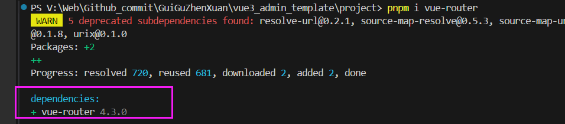

- 【步骤2】新建文件夹 /src/views 放置路由

 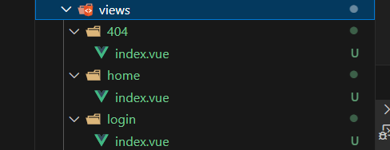

- 【步骤3】/src/router/index.ts

模板路由配置

- 【步骤4】在 main.ts 中配置

```typescript
import router from './router'

const app = createApp(App) //获取实例对象

app.use(router)

app.mount('#app') // 将应用挂载
```

- 【步骤5】App.vue 设置一个可见区域

```
<router-view></router-view>
```

- 【步骤6】检测路由

# 登录

## 静态页面

- element-plus

布局通过 el-row   el-col实现

el-form中的每一个元素都要用 ```<el-form-item>```包裹

使用了 el-input的话，需要绑定响应式数据页面才能够输入，否则不能输入

图标要引入使用 import {User, Lock} from '@element-plus/icons-vue'

- vue3

响应式数据用ref reactive

- CSS

背景图片

```
background: url("@/assets/images/background.jpg"); // 不是background-image
background-size: cover; // 图片保持比例放大或缩小使X轴Y轴都铺满整个容器，但图片超出容器部分会被剪裁掉，图片不变形。
```

宽高

```
width: 100%;
height: 100vh;
vh，是指CSS中相对长度单位，表示相对视口高度（Viewport Height），1vh = 1% * 视口高度
```

margin

```
margin: 20px 0px; 
// 四个数：顺时针排序：上，右，下，左。
// 两个数：上下 左右
```

## 登陆业务

**发请求 接收数据 ，统一在仓库中实现（pinia/vuex）**

【步骤一】引入、创建pinia并配置好

```
pnpm i pinia
```

创建文件夹 /src/store/index.ts

```typescript
import {createPinia} from 'pinia'
// 创建大仓库
let pinia = createPinia()

//略

//对外暴露，入口文件需要安装仓库
export default pinia
```

入口文件main.ts引入 

```typescript
import pinia from './store'
app.use(pinia)
```

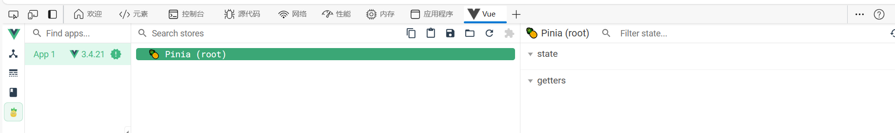

此步骤结束，环境中有 pinia了

【步骤二】

创建用户仓库

 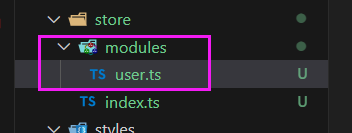

```typescript
// 创建用户相关的小仓库
import {defineStore} from 'pinia'

let useUserStore = defineStore('User', {略})
// 对外暴露获取小仓库的方法
export default useUserStore
```

在组件中使用：

```typescript
import useUserStore from '@/store/modules/user'
let userStore = useUserStore()
```

【总结】

<font color="Red">登录页面的逻辑：点击登录后跳转页面。因为登陆成功的TOKEN以后发请求时都用得到，所以存储在仓库pinia里。</font>

<font color="Red">在仓库（pinia）中编写登录逻辑。且用到api中的接口。</font>

<font color="Red">仓库用来实现接收&返回给页面数据的逻辑，也用来与接口进行交接。</font>

<font color="Red">API中实现与后端的交互。</font>

<font color="Red">TS限制数据类型</font>

<font color="Red">utils/token.ts 封装本地存储数据 与  读取数据的方法</font>

## 登陆时间

登录成功之后的 早上好/下午好/晚上好。

思路：封装一个函数，获取一个结果：当前是上午/下午/晚上，通过内置函数Date。放在utils下面。

## 表单检验

> elementUI

- el-form

属性model：表单数据收集到哪个对象身上

属性rules：按照什么规则收集。

需要校验的 el-form-item身上都需要加一个 prop

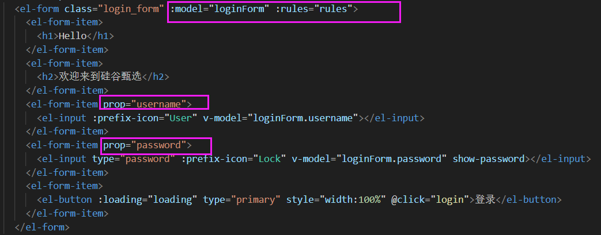

```typescript
const rules ={
  username:[
    //required表示这个字段必须校验
    { required: true, message: '用户名不能为空', trigger: 'blur' },
    { required: true, min: 3, max: 5, message: '账号长度至少3位', trigger: 'change' }
  ],
  password:[
    { required: true, min: 3, max: 10, message: '密码长度至少3位', trigger: 'change' }
  ]
}
```

- 表单校验通过之后才可以提交（通过 Form表单中的 validate函数）

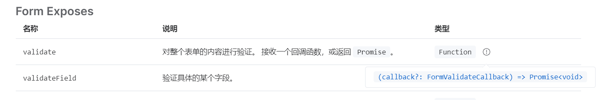

```
//保证全部表单项校验通过再发请求
<el-form ref="loginForms">

let loginForms = ref()
await loginForms.value.validate() //保证全部表单项校验通过再发请求
```

### 自定义校验规则

```typescript
function validatorUserName(rule: any, value: any, callback: any) {
  // rule: 校验规则对象
  // value：表单元素文本内容
  // callback：回调函数，如果符合条件就通过callback放行。如果不符合条件，callback注入错误信息
  if(value.length >= 3){
    callback();
  } else {
    callback(new Error('账号长度至少3位'))
  }
}

const rules ={
  username:[
    { required: true, trigger: 'change', validator: validatorUserName }
  ]
}
```

# layout组件

## 静态搭建

（1）菜单栏宽高、颜色，可以放在公共的scss文件中

```
// 左侧菜单宽度
$base-menu-width: 260px;
// 左侧菜单的背景颜色
$base-menu-background: #001529;
//顶部导航高度
$base-tabbar-height: 100px
```

（2）CSS中的宽度可以计算得到

```
width: calc(100% - $base-menu-width);
```


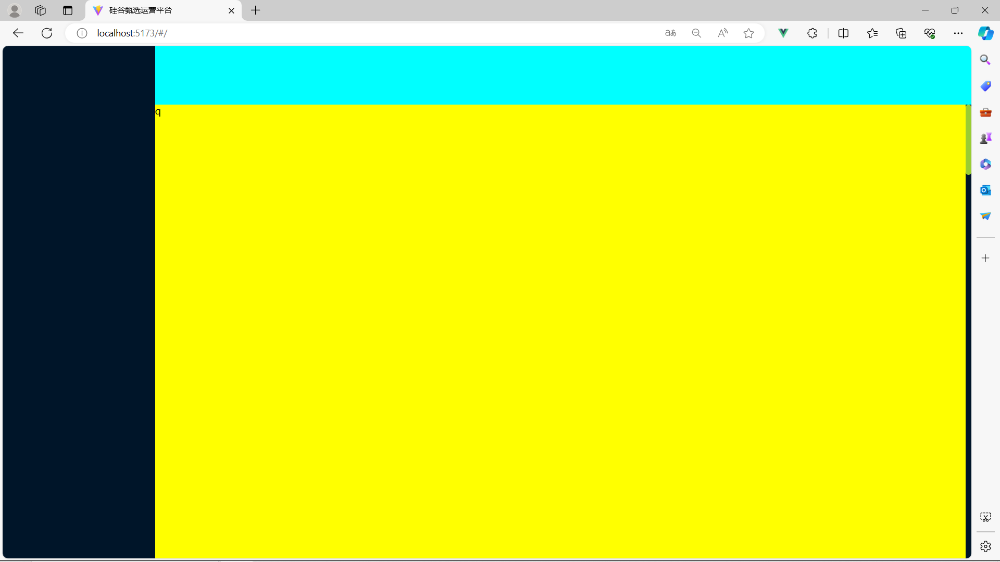

## logo组件封装

 

项目的标题和LOGO单独摘出到 setting.ts

## 左侧菜单

### 静态搭建

element UI

```vue
<template>
  <div class="layout_container">   
    <!-- 左侧菜单 -->
    <div class="layout_slider">
      <Logo></Logo>
      <!-- 滚动组件 -->
      <el-scrollbar class="scrollbar">
        <!-- <p v-for="item in 20" :key="item" class="scrollbar-demo-item">{{ item }}</p> -->
        <el-menu background-color="#001529" text-color="white"> 
          <el-menu-item index="1">首页</el-menu-item>
          <el-menu-item index="2">数据大屏</el-menu-item>
          <!-- 折叠菜单 -->
          <el-sub-menu index="3">
            <!-- 这个是具名插槽 -->
            <template #title>权限管理</template>
            <el-menu-item index="3-1">用户管理</el-menu-item>
            <el-menu-item index="3-2">角色管理</el-menu-item>
            <el-menu-item index="3-3">菜单管理</el-menu-item>
          </el-sub-menu>
        </el-menu>
      </el-scrollbar>
    </div>
    <!-- 顶部导航 -->
    <div class="layout_tabbar"></div>
    <!-- 内容展示区 -->
    <div class="layout_main">
      <p style="height:5000px">q</p>
    </div>
  </div>
</template>

<script setup lang="ts">
 //import {ref, reactive} from 'vue'
 import Logo from './logo/index.vue'
 import Menu from './menu/index.vue'
</script>
```

### 菜单-递归组件

路由是一个数组，我们的菜单通过遍历路由数组得到。

如果没有子路由，使用一级菜单；如果只有一个子路由，使用一级菜单；如果有多个子路由，用下拉菜单。

递归组件必须起名字，如果vue3的起名不好用，就用vue2的 ```export default { name: 'Menu'}```

并不是所有路由都需要在菜单展示（在路由数组中提供判断）

### 菜单图标

/SRC/index.ts 全局引入element ui的图标

### 项目菜单展开

el-menu :default-active

default-active设置为 el-menu中唯一的index时，刷新页面也会默认展开菜单。因为之前我们书写菜单的时候，每个item的index都绑定了路由，所以这里用路由

### 菜单折叠

P44

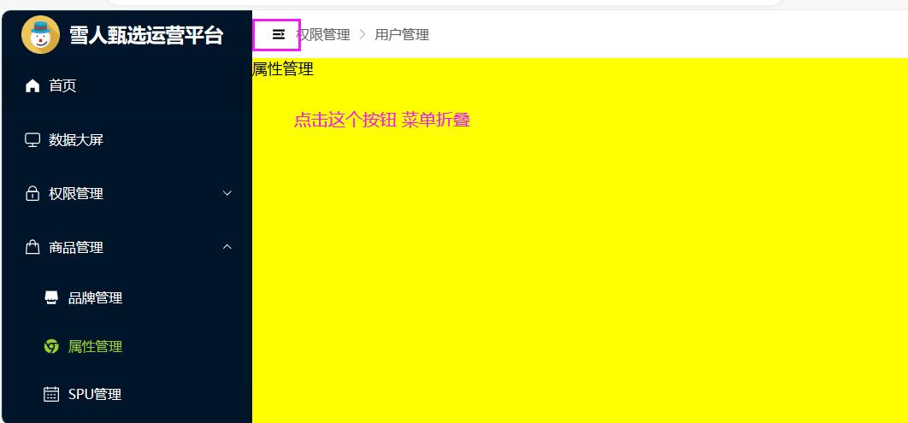

 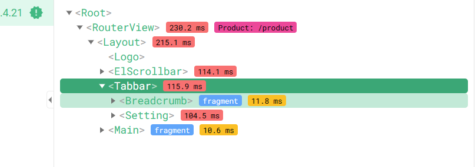

涉及到孙子 Breadcrumb 给爷组件 Layout 传递参数

## 面包屑

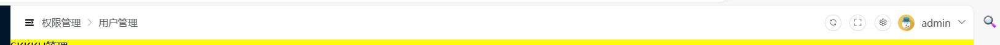

### 动态展示面包屑

```typescript
import { useRoute } from 'vue-router';
const $route = useRoute()

const handler = ()=>{
  console.log($route.matched); //获取匹配到 路由数组（一级、二级、三级）
}
```

breadcrumb中的to属性可以用来跳转

```
<el-breadcrumb-item :to="item.path">
```

## 刷新

> watch监听
>
> 销毁组件可以通过 v-if 
>
> nextTick ：nextTick所指定的回调会在浏览器更新DOM完毕之后再执行。

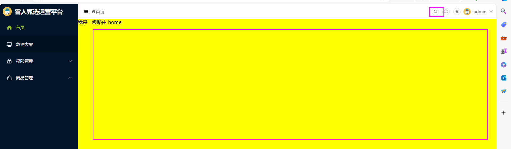

局部刷新。

 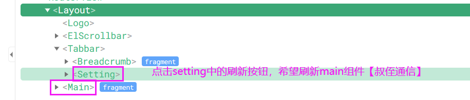

【叔侄通信】：pinia。

侄子组件中通过点击button修改 仓库中的refsh

叔叔组件 Main中监听仓库数据是否变化，如果变化，说明点击过刷新的按钮

## 全屏模式

> ① document.fullscreenElement 
>
> 这个DOM对象属性可以用来判断当前是不是全屏
>
> ②  document.documentElement.requestFullscreen();
>
> 文档根节点的方法requestFullscreen实现全屏模式
>
> ③ 推出全屏模式
>
>   document.exitFullscreen()

## token

> onMounted
>
> token在所有地方都需要=>放在仓库里

登录成功，服务器返回数据，用的插件 json web token 会返回一个token（每一个用户的唯一标识）。

因为token很多地方要用，就存储在仓库中。

最开始进入这个界面的时候（挂载的时候），就要获取token。要根据路由数组分析，进入到本页面的时候，是哪个组件先进

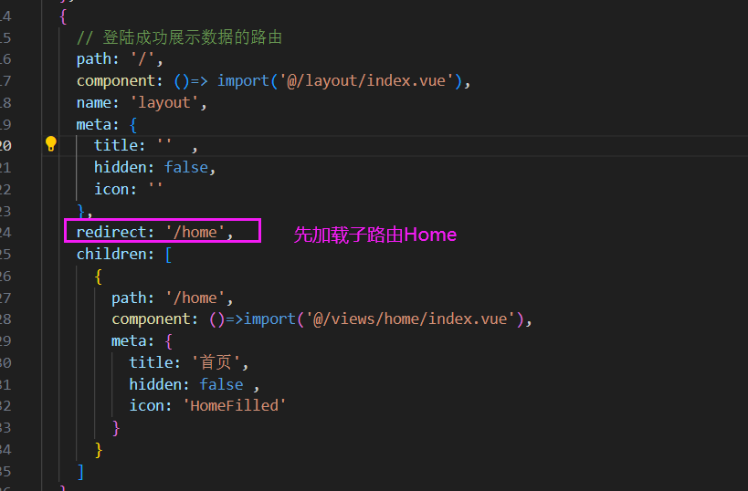

### 退出登录

> route携带参数 

```typescript
// 登出
$router.push({
    path: '/login',
    query: { redirect: $route.path }
  })
  
// 登入
let redirect:any = $route.query.redirect
   $router.push({
    path: redirect || '/'
 })
```


① 向服务器发请求（退出登录接口）

② 仓库中删除用户信息（token username avatar）

③ 跳转到登陆界面

**在哪个路由登出，登陆后就要保持在哪个路由**

### 路由鉴权 路由守卫 

> 全局守卫：项目中任意路由切换都会触发的钩子
>
> 组件外使用仓库

① 任意路由切换实现进度条效果 

解决方法：全局路由守卫+nprogress（插件 pnpm i nprogress）

② 路由组件访问权限的设置（没有登陆的时候 一些路由不可以访问，用户登录不能访问login）

③【每次切换路由的时候用户信息保证不变】 场景是 刚登陆完，用户拿到后台给的token，但此时没有用户信息（还包括订单权限什么的），就统一在路由首位中获取一下用户的信息。


**组件外使用仓库**

```typescript
//在组件的外部想直接引入小仓库是不可以的，必须先引入大仓库
import useUserStore from './store/modules/user'
import pinia from './store'
let userStore = useUserStore(pinia)
console.log(userStore);
```


# 真实接口替换mock

① 【.env.development】环境变量中设置 开发环境使用的 后端URL 

```
VITE_APP_BASE_API = '/api'
VITE_SERVE = 'http://sph-api.atguigu.cn'
```

② 【vite.config.ts】解决跨域问题：vite中的 代理服务器

```typescript
import { defineConfig, loadEnv } from 'vite'
export default defineConfig(({command, mode})  => {
 // 获取各种环境下对应的变量
 let env = loadEnv(mode, process.cwd() )
```

 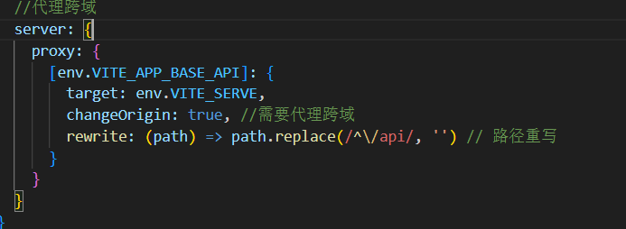

③ 【/api/user/index.ts】API中替换之前的URL

④ 【/store/modules/user.ts】因为登录页面发送请求（调用API） 是在仓库中实现的

vite获取根目录的方法 process.cwd() ，index.html所在的位置


## 接口文档

服务器域名:http://sph-api.atguigu.cn
swagger文档:
http://139.198.104.58:8209/swagger-ui.html
http://139.198.104.58:8212/swagger-ui.html#/

echarts:国内镜像网站
https://www.isqqw.com/echarts-doc/zh/option.html#title
http://datav.aliyun.com/portal/school/atlas/area_selector

## ts限制

登录接口，发送请求的时候，携带用户名&密码参数

```typescript
export const reqLogin = (data:loginFormData) => {
  return request.post<any,loginResponseData>(API.LOGIN_URL, data)
  //loginResponseData限制返回类型
}
```

第一个any表示相应的数据类型，第二个参数表示响应数据的结构类型


# 问题

SCSS的reset可能没有弄好，导致网页有一个圆弧边框

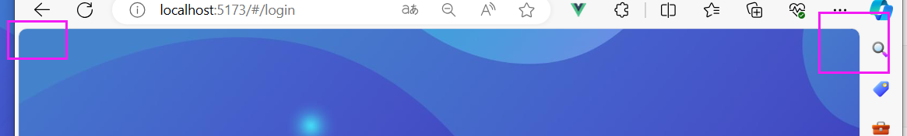


# 【品牌管理】

静态搭建 => 分页、刷新时获取动态数据 （这一步要配置API）=> 新增品牌、修改品牌（对话框、这一步图片那部分比较难、表单校验）

## 静态搭建

el-card

el-table

el-pagination

## api

http://139.198.104.58:8209/swagger-ui.html#!/base45trademark45controller/indexUsingGET

>V:\Web\Github_commit\GuiGuZhenXuan\vue3_admin_template\project\src\api\product\trademark\index.ts


## 上传图片不懂

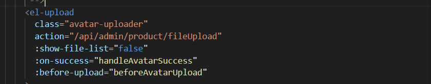

## form验证

form解构数据

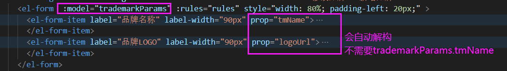

form表单校验 图片的时机 利用

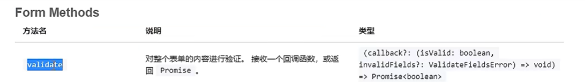

获取form表单实例，validate函数返回的是一个promise对象

配套有一个函数 clearValidate('logoUrl') 清除验证规则

```
  formRef.value?.clearValidate('tmName')
  有el-form之后才清除，没有就不清楚
```

也可以使用nextTick

# axios<any,any>

https://juejin.cn/post/7169850876494888996


elementUI 用户头像上传


新增品牌和更新品牌，一个不带ID（后端分配），一个带ID（需要用ID唯一识别）


# 【属性管理】

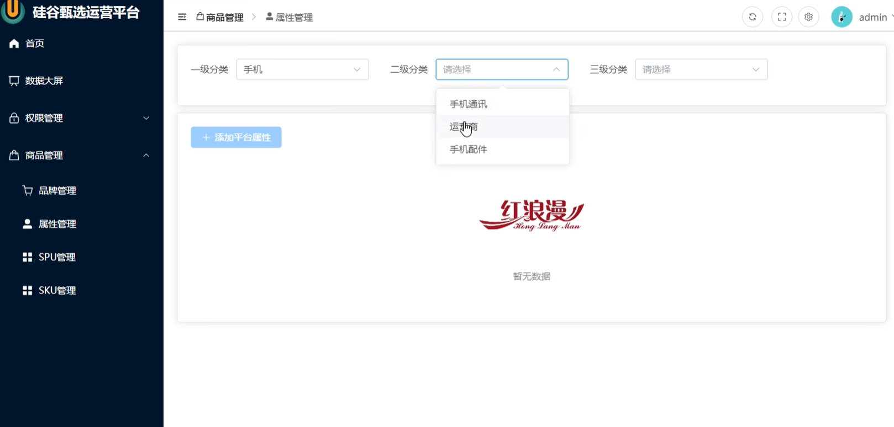

onMounted：发一次请求，获取一级分类。在一级分类被确定的时候，请求二级分类。在二级分类被确定后，请求三级分类。

## 静态搭建

> ① 行内表单：el-form里面的元素独占一行，但一级、二级、三级分类是在同一行。所以要设置表单的inline属性为true
>
> ② el-card、el-form（el-option）、el-select、el-table
>
> ③ 全局组件

```vue
<template>
  <div class="attr_box">
    <el-card>
      <el-form :inline="true">
        <el-form-item label="一级分类">
          <el-select>
            <el-option label="北京"></el-option>
            <el-option label="上海"></el-option>
            <el-option label="广州"></el-option>
            <el-option label="深圳"></el-option>
          </el-select>
        </el-form-item>
        <el-form-item label="二级分类">
          <el-select>
            <el-option label="北京"></el-option>
            <el-option label="上海"></el-option>
            <el-option label="广州"></el-option>
            <el-option label="深圳"></el-option>
          </el-select>
        </el-form-item>
        <el-form-item label="三级分类">
          <el-select>
            <el-option label="北京"></el-option>
            <el-option label="上海"></el-option>
            <el-option label="广州"></el-option>
            <el-option label="深圳"></el-option>
          </el-select>
        </el-form-item>
      </el-form>
    </el-card>
    <el-card style="margin-top: 20px;">
      <el-button type="primary" size="default" icon="Plus" style="margin-bottom: 10px;">添加属性</el-button>
      <el-table border style="margin: 10px 0px;">
        <el-table-column label="序号" type="index" align="center" width="80px"></el-table-column>
        <el-table-column label="属性名称" width="120px"></el-table-column>
        <el-table-column label="属性值名称"></el-table-column>
        <el-table-column label="操作" width="120px"></el-table-column>
      </el-table>
    </el-card>
  </div>
</template>
```

 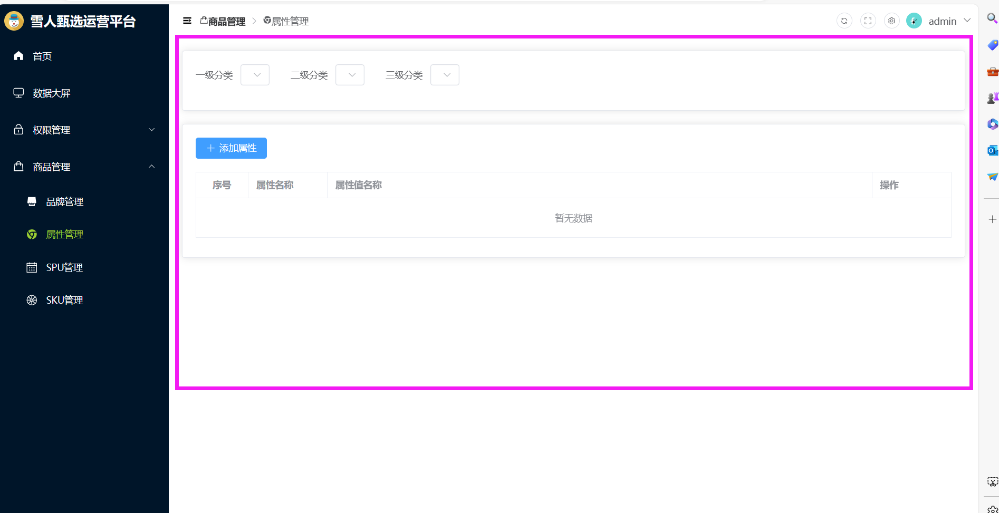


因为下拉部分别的页面也需要，所以注册为全局组件


## API接口定义

```typescript
//属性相关API文件
import request from "@/utils/request";

enum API {
  //一级分类接口地址
  C1_URL = '/admin/product/getCategory1',
  //二级
  C2_URL = '/admin/product/getCategory2/',
  C3_URL = '/admin/product/getCategory3/'
}

export const reqC1 = () => {
  return request.get<any, any>(API.C1_URL)
}


export const reqC2 = (category1ID: number) => {
  return request.get<any, any>(API.C2_URL + category1ID)
}


export const reqC3 = (category2ID: number) => {
  return request.get<any, any>(API.C3_URL + category2ID)
}
```


## 页面中调用API

### el-select使用

- option
  - label是下拉菜单显示的数据
  - value是下拉菜单收集的数据，真正要绑定要依靠value属性

```vue
<el-select  v-model=" c1Id" style="width: 200px">
  <el-option  v-for="(item, index) in c1Arr" 
              :key="item.id" 
              :label="item.name"
              :value="item.id"></el-option>
</el-select>

//收集菜单的数据
let c1Id = <number | string>('')
```

### 仓库的使用

因为我们把下拉菜单注册为全局组件，所以他在【属性管理】页面中属于子组件。

当子组件中确定了，一级分类、二级分类、三级分类时，父组件中需要呈现对应的数据。**涉及到组件通讯，为了方便起见，使用仓库更加合适。**


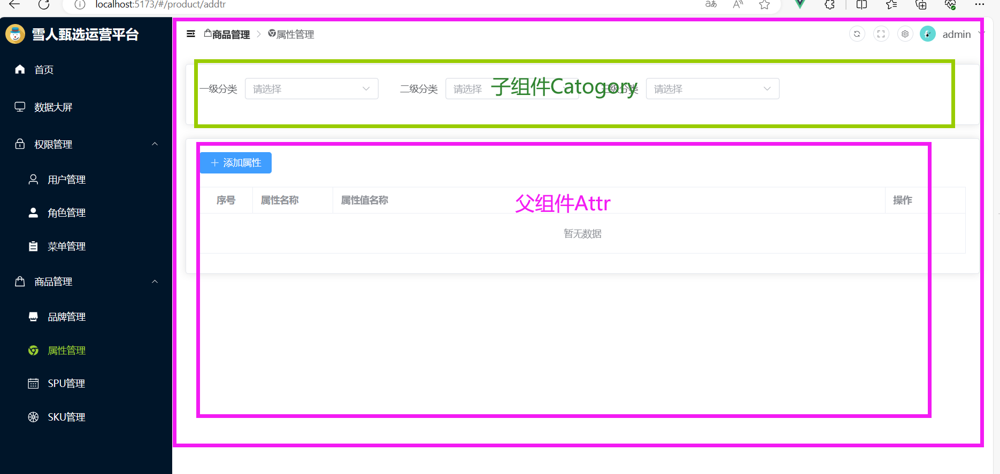

### TS类型限制

① /api/ 服务器请求时，发送数据&接收数据时 的数据类型

② 仓库中的类型

## 二级分类请求发送时间

> 根据上文，一级分类的请求已经编写完毕。开始考虑二级分类

① 全局组件Category中，**监听store**中 C1ID（一级分类的选择）的变化，如果变化了就去请求二级菜单。

② el-select中有一个 change事件，当选中值的时候触发，保证一级分类ID存在

```    <el-select @change="回调函数">```

## 卡片内容的切换

```typescript
let scene = ref<number>(0)
```

card组件内容切换变量

scene=0. 显示table数据；scene=1，展示添加与修改属性结构

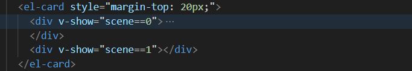

# 记录

P74

- 属性管理-修改属性  深拷贝 浅拷贝  

``` typescript
// 浅拷贝
Object.assign(attrParams, row)

// 深拷贝
Object.assign(attrParams, JSON.parse(JSON.stringify(row)))
```

清空仓库 数据  4reset方法

# 【SPU】

SPU: 电商术语，代表一个标准化产品单元

SPU组成：产品品牌名字、描述、公司旗下产品图片介绍、销售属性


SKU：库存量最小单元


P79

v-show 性能

自定义事件 子组件给父组件传参

P80 

修改SPU

P81 

点击修改SPU，跳转页面。父组件=>子组件，但此时父组件的数据不完整。需要发四个请求才能组成一个完整的SPU。

这四个请求的发送时机：不可以在子组件的onMounted中发送，因为我们使用的是v-show显示，已经存在了。在子组件中定义函数，然后在父组件中获取子组件的实例，

P84

照片墙

P87

数组查看是否重复 find方法

P88

照片墙数组数据处理，map方法

P89 

spuForm.vue

子组件中 对外暴露initAddSpu
