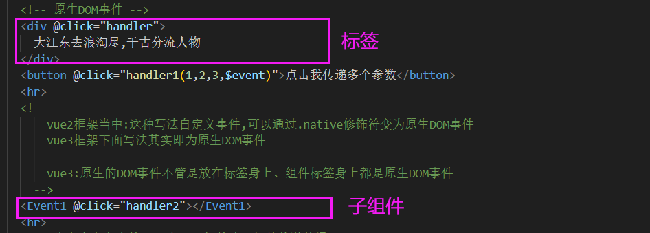
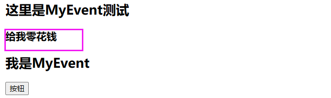

#                    硅谷甄选运营平台1

此次教学课程为硅谷甄选运营平台项目,包含运营平台项目模板从0到1开发，以及数据大屏幕、权限等业务。

硅谷甄选运营平台 涉及到技术栈包含***:vue3+TypeScript+vue-router+pinia+element-plus+axios+echarts***等技术栈。

## 一、vue3组件通信方式

**比如:vue2组件通信方式**

**props:**可以实现父子组件、子父组件、甚至兄弟组件通信

**自定义事件**:可以实现子父组件通信

**全局事件总线$bus**:可以实现任意组件通信

**pubsub:**发布订阅模式实现任意组件通信

**vuex**:集中式状态管理容器，实现任意组件通信

**ref**:父组件获取子组件实例VC,获取子组件的响应式数据以及方法

**slot:**插槽(默认插槽、具名插槽、作用域插槽)实现父子组件通信........


- gitee克隆

**通信仓库地址:https://gitee.com/jch1011/vue3_communication.git**

> git clone https://gitee.com/jch1011/vue3_communication.git

> npm i 下载依赖的包

> npm run dev 运行项目

### 1.1props

props可以实现父子组件通信，在vue3中我们可以通过**defineProps**获取父组件传递的数据。且在组件内部不需要引入defineProps方法可以直接使用！

（在vue2中 props:[]接收，props是配置项）

<font color="Red">**使用细节：**</font>

<font color="Red">① defineProps(['XXX']) 接收到的XXX可以在模板中直接使用。</font>

<font color="Red">② 不能在setup语法中使用，如果要在setup中使用就要定义变量接收。变量会是一个对象。</font>

<font color="Red">③ defineProps() 里面可以用对象接收，也可以用数组接收。</font>

- **示例**

父组件给子组件传递数据

```vue
<Child info="我爱祖国" :money="money"></Child>
```

**子组件获取父组件传递数据:方式1（对象接收-方便做限制）**

```typescript
let props = defineProps({
  info:{
   type:String,//接受的数据类型
   default:'默认参数',//接受默认数据
  },
  money:{
   type:Number,
   default:0
}})
```

**子组件获取父组件传递数据:方式2**

```typescript
let props = defineProps(["info",'money']);
```

子组件获取到props数据就可以在模板中使用了,但是切记props是只读的(只能读取，不能修改)

### 1.2自定义事件

在vue框架中事件分为两种：一种是原生的DOM事件，另外一种自定义事件。

原生DOM事件可以让用户与网页进行交互，比如click、dbclick、change、mouseenter、mouseleave....

**自定义事件可以实现<font color="red">子组件给父组件</font>传递数据**

#### 1.2.1原生DOM事件

代码如下:

```vue
 <pre @click="handler">
      我是祖国的老花骨朵
 </pre>
```


当前代码级给pre标签绑定原生DOM事件点击事件,**默认会给事件回调注入event事件对象**。当然点击事件想注入多个参数可以按照下图操作。但是切记注入的事件对象务必叫做 **$event.**

```vue
<div @click="handler1(1,2,3,$event)">我要传递多个参数</div>

<script>
// 默认的 event事件对象
const handler = (event)=>{
    //event即为事件对象
    console.log(event);
}
//事件回调--2
const handler1 = (a,b,c,$event)=>{
   console.log(a,b,c,$event)
}
</script>
```


- vue2 和 vue3 区别

 

在vue2中，如果在组件标签中使用原生DOM事件（click、dbclick、change），会把它们当作自定义事件。需要通过native修饰符才能变为原生DOM事件。

在vue3框架click、dbclick、change(这类原生DOM事件),不管是在标签、自定义标签上(组件标签)都是原生DOM事件。除非在defineEmits注册了和原生DOM时间的同名自定义事件。

#### 1.2.2自定义事件

自定义事件可以实现子组件给父组件传递数据。在项目中是比较常用的。

比如在父组件内部给子组件(Event2)绑定一个自定义事件

```vue
<Event2  @xxx="handler3"></Event2>
```

在Event2子组件内部触发这个自定义事件

```vue
<template>
  <div>
    <h1>我是子组件2</h1>
    <button @click="handler">点击我触发xxx自定义事件</button>
  </div>
</template>

<script setup lang="ts">
// 利用defineEmits方法返回函数触发自定义事件
// defineEmits返回值是一个箭头函数，用$emit接收（不一定叫这个名字），最后通过调用 $emit触发事件
let $emit = defineEmits(["xxx"]);

// 按键点击后的回调函数
const handler = () => {
  // 第一个参数 事件类型
  // 第二个|三个|N参数即为注入数据
  $emit("xxx", "法拉利", "茅台");
};
</script>
<style scoped>
</style>
```

我们会发现在script标签内部,使用了defineEmits方法，此方法是vue3提供的方法,不需要引入直接使用。defineEmits方法执行，传递一个数组，数组元素即为将来组件需要触发的自定义事件类型，此方执行会返回一个$emit方法用于触发自定义事件。

当点击按钮的时候，事件回调内部调用$emit方法去触发自定义事件,第一个参数为触发事件类型，第二个、三个、N个参数即为传递给父组件的数据。


需要注意的是:代码如下

```vue
<Event2  @xxx="handler3" @click="handler"></Event2>
```

正常说组件标签书写@click应该为原生DOM事件,但是如果子组件内部通过defineEmits定义就变为自定义事件了

```typescript
let $emit = defineEmits(["xxx",'click']);
```

#### 原生事件&自定义事件中的event

① 原生DOM事件中的event

```vue
<button @click="test1">按钮</button>
<script>
  function test1(event){  // 默认会给事件回调注入event事件对象
    console.log(event);
  }
</script> 

<!--   **************************************************   -->

<button @click="test2(a,b,$event)">按钮</button>
<script>
  function test1(a,b,$event){  // 如果有多个参数，注入的事件对象叫做 $event
    console.log(a,b,$event);
  }
</script> 
```

② 在自定义事件中，$event是传递过来的数据

子组件MyEvent.vue ：

```vue
<template>
  <h2>我是MyEvent</h2>
  <button @click="haha">按钮</button>
</template>

<script setup lang="ts" name="MyEvent">
  let dataToFather = "给我零花钱"
  const $emit = defineEmits(['sendTest'])
  const haha = ()=>{
    $emit("sendTest",dataToFather)
  }
</script>
```

父组件：

```vue
 <template>
  <h2>这里是MyEvent测试</h2>
  <h3>{{ data }}</h3>
  <MyEvent @sendTest="data = $event"></MyEvent>
  </div>
</template>

<script setup lang="ts">
  import {ref} from 'vue'
  let data = ref('');
</script> 
```

页面显示：



### 1.3全局事件总线

全局事件总线可以实现任意组件通信，在vue2中可以根据VM与VC关系推出全局事件总线。

但是在vue3中没有Vue构造函数，也就没有Vue.prototype.以及组合式API写法（setup）没有this，

所以在Vue3想实现全局事件的总线功能就有点不现实啦，如果想在Vue3中使用全局事件总线功能

可以使用插件mitt实现。

**mitt:官网地址:https://www.npmjs.com/package/mitt**

- 示例

> npm i mitt

```typescript
//引入mitt插件:mitt一个方法,方法执行会返回bus对象
import mitt from 'mitt';
const $bus = mitt();
export default $bus;
// $bus方法: all emit off on
```

接收消息的组件 用 $bus.on

```typescript
//引入$bus对象
import $bus from '../../bus';
//组件挂载完毕的时候,当前组件绑定一个事件,接收将来兄弟组件传递的数据
onMounted(() => {
  //第一个参数:即为事件类型  第二个参数:即为事件回调
  $bus.on("car", (car) => {
    console.log(car);
  });
});
```

发送消息的组件 用  $bus.emit

```typescript
//引入$bus对象
import $bus from '../../bus';
//点击按钮回调
const handler = ()=>{
  $bus.emit('car',{car:"法拉利"});
}
```


### 1.4v-model

> V:\Web\Github_commit\GuiGuZhenXuan\vue3_basic\vue3_communication\src\views\04_v-model\Child.vue

v-model指令可是收集表单数据(数据双向绑定)，除此之外它也可以实现**父子组件数据同步**。而v-model本质上是利用props[modelValue]与自定义事件[update:modelValue]实现的。

- 下方代码:相当于给组件Child传递一个props(modelValue)与绑定一个自定义事件update:modelValue实现父子组件数据同步

```vue
子组件和父组件同步的是msg数据
<Child v-model="msg"></Child>
```

默认子组件中 用 defineProps(["modelValue"]) 接收。用defineEmits(['update:modelValue'])触发。

- 在vue3中一个组件可以通过使用**多个v-model**,让父子组件多个数据同步,下方代码相当于给组件Child传递两个props分别是pageNo与pageSize，以及绑定两个自定义事件update:pageNo与update:pageSize实现父子数据同步

```vue
子组件和父组件同步的是msg数据、 msg1数据
<Child v-model:pageNo="msg" v-model:pageSize="msg1"></Child>
```

默认子组件中 用 defineProps(["modelValue"]) 接收。用defineEmits(['update:modelValue'])触发。但是有多个数据的时候，可以设置属性名字XXX YYY区分，

```typescript
let props = defineProps(["pageNo", "pageSize"]);
let $emit = defineEmits(["update:pageNo", "update:pageSize"]);
```


### 1.5useAttrs

> 可以对UI库（Element UI）中的元素进行二次封装

在Vue3中可以利用useAttrs方法获取组件的属性与事件(包含:原生DOM事件或者自定义事件),次函数功能类似于Vue2框架中$attrs属性与$listeners方法。

比如:在父组件内部使用一个子组件my-button

```vue
<my-button type="success" size="small" title='标题' @click="handler"></my-button>
```

子组件内部可以通过useAttrs方法获取组件属性与事件.因此你也发现了，它类似于props,可以接受父组件传递过来的属性与属性值。需要注意如果defineProps接受了某一个属性，useAttrs方法返回的对象身上就没有相应属性与属性值。

```vue
<script setup lang="ts">
import {useAttrs} from 'vue';
let $attrs = useAttrs();
</script>
```


### 1.6ref与$parent


ref,提及到ref可能会想到它可以获取元素的DOM或者获取子组件实例的VC。既然可以在父组件内部通过ref获取子组件实例VC，那么子组件内部的方法与响应式数据父组件可以使用的。

比如:在父组件挂载完毕获取组件实例

父组件内部代码:

```
<template>
  <div>
    <h1>ref与$parent</h1>
    <Son ref="son"></Son>
  </div>
</template>
<script setup lang="ts">
import Son from "./Son.vue";
import { onMounted, ref } from "vue";
const son = ref();
onMounted(() => {
  console.log(son.value);
});
</script>
```

但是需要注意，如果想让父组件获取子组件的数据或者方法需要通过defineExpose对外暴露,因为vue3中组件内部的数据对外“关闭的”，外部不能访问

```
<script setup lang="ts">
import { ref } from "vue";
//数据
let money = ref(1000);
//方法
const handler = ()=>{
}
defineExpose({
  money,
   handler
})
</script>
```

$parent可以获取某一个组件的父组件实例VC,因此可以使用父组件内部的数据与方法。必须子组件内部拥有一个按钮点击时候获取父组件实例，当然父组件的数据与方法需要通过defineExpose方法对外暴露

```
<button @click="handler($parent)">点击我获取父组件实例</button>
```

### 1.7provide与inject

**provide[提供]**

**inject[注入]**

vue3提供两个方法provide与inject,可以实现隔辈组件传递参数

组件组件提供数据:

provide方法用于提供数据，此方法执需要传递两个参数,分别提供数据的key与提供数据value

```
<script setup lang="ts">
import {provide} from 'vue'
provide('token','admin_token');
</script>
```

后代组件可以通过inject方法获取数据,通过key获取存储的数值

```
<script setup lang="ts">
import {inject} from 'vue'
let token = inject('token');
</script>
```

### 1.8pinia

**pinia官网:https://pinia.web3doc.top/**

pinia也是集中式管理状态容器,类似于vuex。但是核心概念没有mutation、modules,使用方式参照官网

### 1.9slot

插槽：默认插槽、具名插槽、作用域插槽可以实现父子组件通信.

**默认插槽:**

在子组件内部的模板中书写slot全局组件标签

```
<template>
  <div>
    <slot></slot>
  </div>
</template>
<script setup lang="ts">
</script>
<style scoped>
</style>
```

在父组件内部提供结构：Todo即为子组件,在父组件内部使用的时候，在双标签内部书写结构传递给子组件

注意开发项目的时候默认插槽一般只有一个

```
<Todo>
  <h1>我是默认插槽填充的结构</h1>
</Todo>
```

**具名插槽：**

顾名思义，此插槽带有名字在组件内部留多个指定名字的插槽。

下面是一个子组件内部,模板中留两个插槽

```
<template>
  <div>
    <h1>todo</h1>
    <slot name="a"></slot>
    <slot name="b"></slot>
  </div>
</template>
<script setup lang="ts">
</script>

<style scoped>
</style>
```

父组件内部向指定的具名插槽传递结构。需要注意v-slot：可以替换为#

```
<template>
  <div>
    <h1>slot</h1>
    <Todo>
      <template v-slot:a>  //可以用#a替换
        <div>填入组件A部分的结构</div>
      </template>
      <template v-slot:b>//可以用#b替换
        <div>填入组件B部分的结构</div>
      </template>
    </Todo>
  </div>
</template>

<script setup lang="ts">
import Todo from "./Todo.vue";
</script>
<style scoped>
</style>
```

**作用域插槽**

作用域插槽：可以理解为，子组件数据由父组件提供，但是子组件内部决定不了自身结构与外观(样式)

子组件Todo代码如下:

```
<template>
  <div>
    <h1>todo</h1>
    <ul>
     <!--组件内部遍历数组-->
      <li v-for="(item,index) in todos" :key="item.id">
         <!--作用域插槽将数据回传给父组件-->
         <slot :$row="item" :$index="index"></slot>
      </li>
    </ul>
  </div>
</template>
<script setup lang="ts">
defineProps(['todos']);//接受父组件传递过来的数据
</script>
<style scoped>
</style>
```

父组件内部代码如下:

```
<template>
  <div>
    <h1>slot</h1>
    <Todo :todos="todos">
      <template v-slot="{$row,$index}">
         <!--父组件决定子组件的结构与外观-->
         <span :style="{color:$row.done?'green':'red'}">{{$row.title}}</span>
      </template>
    </Todo>
  </div>
</template>

<script setup lang="ts">
import Todo from "./Todo.vue";
import { ref } from "vue";
//父组件内部数据
let todos = ref([
  { id: 1, title: "吃饭", done: true },
  { id: 2, title: "睡觉", done: false },
  { id: 3, title: "打豆豆", done: true },
]);
</script>
<style scoped>
</style>
```

